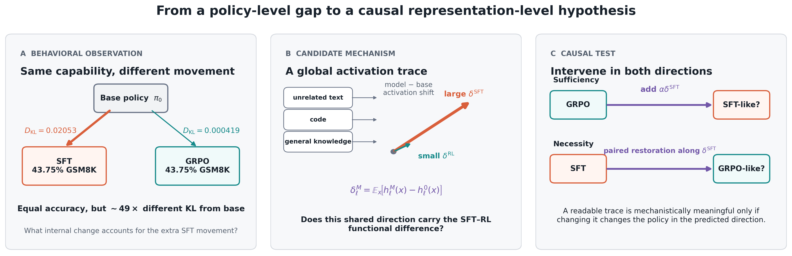
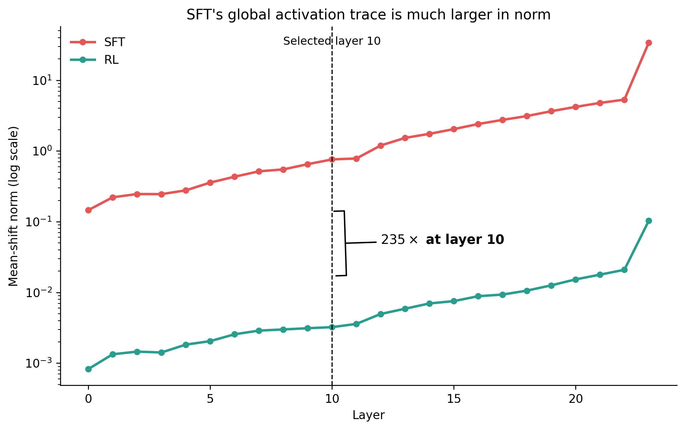
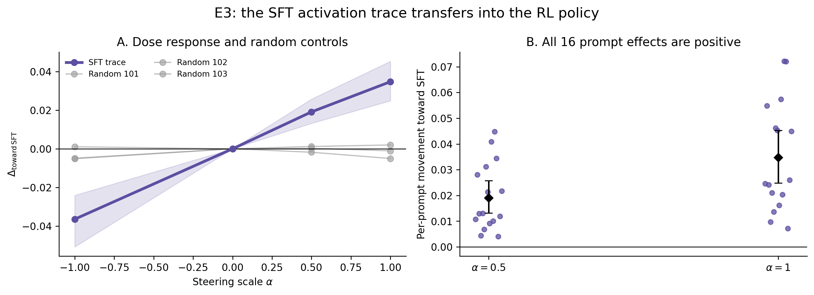
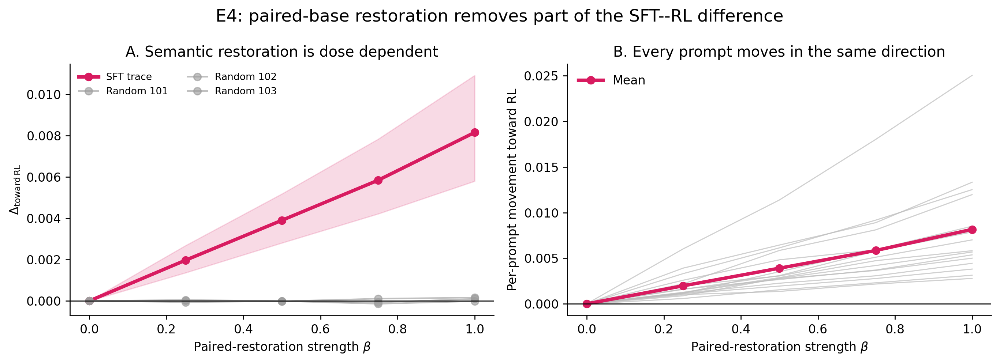

# Can an Activation Trace Capture the Difference Between SFT and Online RL?

This repository contains a small causal model-diffing study of how supervised fine-tuning (SFT)
and online reinforcement learning (GRPO) modify the same language model. It trains
accuracy-matched policies, extracts their mean activation shifts from the base model, and tests
whether the SFT-derived direction can causally move behavior between the two policies.



## Main finding

At matched held-out GSM8K accuracy, SFT moved much farther from the base policy than GRPO in both
output-distribution and activation space. A mean SFT-minus-base activation direction extracted at
layer 10 was not only readable: adding it to GRPO moved GRPO toward SFT, and removing the naturally
occurring component along the same direction moved SFT toward GRPO. Random-direction controls did
not reproduce either effect.

This is evidence that a one-dimensional activation trace captures a causally relevant part of the
SFT–RL difference in this setting. It is **not** evidence that the direction completely explains
the difference, nor that it causes catastrophic forgetting. The paired-restoration experiment
also moves SFT toward the nearby base policy, so an RL-specific interpretation remains unresolved.

## Key results

All numbers below come from one seed of Qwen2.5-0.5B-Instruct with rank-8 LoRA, trained on 256
GSM8K examples and evaluated on a fixed 48-example held-out set.

| Experiment | Result | Interpretation |
|---|---:|---|
| E1: accuracy matching | SFT 43.75%; GRPO 43.75% | The compared checkpoints have identical held-out task accuracy. |
| E1: forward KL from base | SFT 0.02053; GRPO 0.000419 | SFT is approximately 49× farther from the base policy. |
| E2: held-out globality at layer 10 | SFT 0.9694; GRPO 0.9392 | The discovery-selected globality advantage replicates on 64 untouched confirmation probes. |
| E2: trace magnitude at layer 10 | SFT approximately 235× GRPO | GRPO's mean direction is stable across prompts but much smaller. |
| E3: add one SFT-sized trace to GRPO | 0.03471 KL movement toward SFT | Closes 40.3% of the original SFT–GRPO KL gap; all 16 prompt effects are positive. |
| E3: GSM8K accuracy at full scale | 43.75% → 35.42% | The trace is causally effective but is not task-neutral. |
| E4: full paired restoration in SFT | 0.00816 KL movement toward GRPO | Closes 34.6% of the SFT–GRPO gap; all 16 prompt effects are positive. |
| E4: GSM8K accuracy at full restoration | 47.92% → 35.42% | Removing this component also removes task-relevant information. |
| E5: WinoGrande / HellaSwag | No measurable SFT deficit | The forgetting hypothesis is unresolved; strong answer-position bias makes these weak retention tests here. |

The E4 zero-intervention task accuracy is 47.92% because E4 directly loads the matched SFT
checkpoint. The historical E1 table reports 43.75% from the checkpoint-sweep evaluator; this
known evaluator-state discrepancy does not affect the fixed-prefix KL intervention results.

### E2: activation-trace geometry



The trace at layer $\ell$ is the mean model-minus-base activation difference over unrelated
prompts. Traces are estimated from the final five non-padding prompt positions. Layer selection
uses 64 discovery probes; all reported confirmation statistics use a disjoint set of 64 probes.

### E3: sufficiency



Adding the raw SFT mean-shift vector to the matched GRPO model produces a signed dose response:
positive scales move GRPO toward SFT and the negative scale moves it away. Three independently
sampled random directions, rescaled to the same norm, remain near zero.

### E4: involvement of the naturally occurring component



For each position on a fixed GRPO-sampled trajectory, the SFT and base models are teacher-forced
on the exact same prefix. E4 removes only the projection of that prefix-specific SFT-minus-base
activation change onto the frozen global SFT direction. The monotonic movement toward GRPO and
near-zero random-orientation controls show that the naturally occurring component is functionally
involved. Because GRPO is itself close to base, this result cannot distinguish GRPO-specific
movement from generic restoration toward base.

## Experimental pipeline

| Stage | Question | Primary artifact |
|---|---|---|
| Viability | Does four-generation GRPO provide non-degenerate reward variation on GSM8K? | `base_viability.json` |
| E1 | Which SFT and GRPO checkpoints have the highest shared task accuracy, and how far is each from base? | `matched_pair.json` |
| E2 | Is there a prompt-global activation shift, and where is the discovery-selected SFT–GRPO gap largest? | `selected_layer.json`, `traces.pt` |
| E3 | Does adding the SFT trace to GRPO move its output distribution toward SFT more than random controls? | `e3_metrics.json` |
| E4 | Does removing the naturally occurring SFT component along that trace move SFT toward GRPO? | `e4_metrics.json` |
| E5 | Does SFT lose unrelated-task capability, and does E4 restore it? | `winogrande_retention.json`, `hellaswag_retention.json` |

The frozen experimental specification and estimands are documented in
[`docs/implementation_summary.md`](docs/implementation_summary.md). The exact paired-restoration
design is documented in [`docs/e4_necessity.md`](docs/e4_necessity.md).

## Repository structure

```text
configs/                 Frozen experiment and viability configurations
docs/                    Experiment specifications and README figures
scripts/                 Linux GPU launchers and evaluation workflows
src/mats_experiments/    Training, tracing, intervention, evaluation, and analysis code
tests/                   Unit and parity tests
outputs/                 Selected committed checkpoints and result artifacts
results/README.md        Map from reported claims to machine-readable artifacts
pyproject.toml           Package metadata and dependency groups
uv.lock                  Fully resolved Python environment
```

## Installation

The experiments use Python 3.10 or newer, PyTorch with CUDA, and
[`uv`](https://docs.astral.sh/uv/). The full pipeline was run on one NVIDIA A100-SXM4 40 GB GPU.

```bash
git clone https://github.com/aupc2061/sft_rl_intervention.git
cd sft_rl_intervention
chmod +x scripts/*.sh
./scripts/setup_remote.sh
uv run python -m pytest -q
```

`setup_remote.sh` installs `uv` if necessary and runs `uv sync --all-extras`. Training and
evaluation scripts subsequently use `.venv/bin/python`; no manual activation is required.

## Reproduce the experiment

### 1. Confirm that GSM8K supplies a usable GRPO signal

```bash
export WANDB_PROJECT=sft-rl-intervention  # optional
uv run wandb login                       # only when logging to W&B
./scripts/run_gsm8k_viability.sh configs/gsm8k_grpo_viability.yaml
```

The full run is gated on `suitable_for_grpo: true`. The original viability run used 64 prompt
groups with four generations each and observed a mixed-reward-group fraction of 0.453 and a
truncation fraction of 0.0039.

### 2. Train, evaluate, match checkpoints, and extract traces (E1–E2)

```bash
./scripts/run_mvp_e1_e2.sh configs/mvp_16h_qwen05b_gsm8k.yaml
cat outputs/mvp_16h_qwen05b_gsm8k/mvp_report/matched_pair.json
cat outputs/mvp_16h_qwen05b_gsm8k/mvp_report/selected_layer.json
```

The runner performs an optional synthetic smoke test, trains one SFT and one GRPO policy,
evaluates every saved checkpoint, selects the highest shared-accuracy pair within the configured
tolerance, extracts all-layer traces, and writes `latest_runs.env`.

To skip only the synthetic smoke after validating the setup:

```bash
RUN_SMOKE=0 ./scripts/run_mvp_e1_e2.sh configs/mvp_16h_qwen05b_gsm8k.yaml
```

### 3. Run the causal sufficiency intervention (E3)

```bash
source outputs/mvp_16h_qwen05b_gsm8k/latest_runs.env
./scripts/run_mvp_e3.sh "$CONFIG" "$SFT_RUN" "$RL_RUN" "$REPORT_DIR"
```

This evaluates scales `{-1, 0, 0.5, 1}` for the raw layer-10 SFT trace and three norm-matched
Gaussian controls. The primary output is `$REPORT_DIR/e3_metrics.json`.

### 4. Run paired-base restoration (E4)

```bash
source outputs/mvp_16h_qwen05b_gsm8k/latest_runs.env
./scripts/run_mvp_e4.sh "$CONFIG" "$SFT_RUN" "$RL_RUN" "$REPORT_DIR"
```

The script first runs a mandatory exact-prefix generation-parity smoke test, then evaluates 17
semantic/control cells and performs paired-bootstrap analysis. The primary output is
`$REPORT_DIR/e4_metrics.json`.

### 5. Run the off-task diagnostics (E5)

These are diagnostics rather than positive forgetting results.

```bash
WINOGRANDE_DEVICE=cuda WINOGRANDE_LIMIT=200 ./scripts/run_winogrande_eval.sh
HELLASWAG_DEVICE=cuda HELLASWAG_LIMIT=10042 ./scripts/run_hellaswag_eval.sh
```

For a two-example smoke test, set the corresponding `*_LIMIT=2`. The HellaSwag number reported in
the results table uses the complete 10,042-example validation split.

### 6. Regenerate the additional GPU diagnostics

```bash
./scripts/run_pending_gpu_plots.sh
./scripts/run_remaining_gpu_plots.sh
```

These scripts reproduce the prompt-level geometry, token projection energy, checkpoint dynamics,
trace stability, and token-window ablation artifacts under `mvp_report/pending_gpu_plots/`.

## Configuration and reproducibility notes

- Base model: `Qwen/Qwen2.5-0.5B-Instruct`
- Adaptation: rank-8 LoRA on `q_proj`, `k_proj`, `v_proj`, and `o_proj`
- Training data: 256 GSM8K examples
- Held-out GSM8K evaluation: 48 examples
- Probe data: 128 deterministic unrelated prompts, split 64/64 for discovery/confirmation
- Trace aggregation: final five non-padding prompt tokens
- Selected intervention layer: 10
- Random seed: 1 throughout
- SFT checkpoint: `checkpoint-12`
- GRPO checkpoint: `checkpoint-20`
- Precision: bfloat16; traces stored in float32
- Uncertainty: 2,000-sample paired bootstrap where applicable

The project is deliberately small: one model, task, LoRA configuration, and seed. Results should
be treated as a mechanistic case study, not as evidence that the same direction exists across
models or tasks.

## Tests

```bash
uv run python -m pytest -q
```

The suite covers configuration/data construction, numerical helpers, trace aggregation,
intervention hooks, E3/E4 analysis logic, and the left-padding/KV-cache generation parity fixes
required by paired restoration. The current repository passes all 25 tests.

## Results and checkpoints

[`results/README.md`](results/README.md) maps every headline result to its JSON, CSV, plot, or
checkpoint artifact. The repository includes the matched adapters needed for direct intervention
evaluation as well as checkpoint-series adapters used for the checkpoint-dynamics diagnostic.
The base Qwen weights and public datasets are downloaded from Hugging Face at runtime.

## License

The code in this repository is released under the [MIT License](LICENSE). Model weights and
datasets remain subject to their respective upstream licenses.
